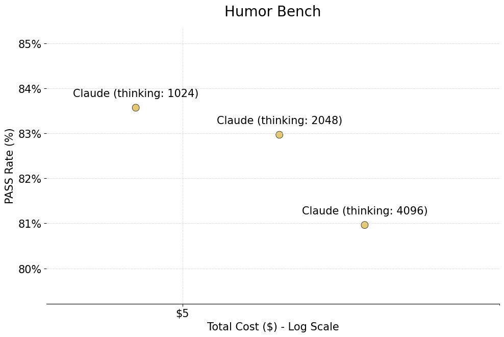

# Humor-Bench

Humor-Bench is a benchmark for evaluating humor understanding in AI Models. This research project includes an autograder system and comprehensive performance analysis across various models.

## Dataset

The Humor-Bench dataset consists of hand-annotated cartoons from the New Yorker Caption Contest. We sourced the original cartoons and captions from the [Nextml Caption Contest Data](https://nextml.github.io/caption-contest-data/), [jmhessel/newyorker_caption_contest](https://huggingface.co/datasets/jmhessel/newyorker_caption_contest) collections, and [CartoonStock](https://www.cartoonstock.com/). 

For each cartoon, we provide:
- Detailed image descriptions, annotated by our team
- Multiple captions sourced from professional humor contests
- A structured "element" field, annotated by us, identifying the specific comedic device or concept

This high-quality ground truth signal allows us to objectively evaluate AI models on their ability to identify and explain humor, making it a robust benchmark for measuring humor comprehension capabilities.

## Autograder and autograder eval

To automate the evaluation of generated humor explanations, Humor-Bench includes an LLM-based autograder (`autograder.py`). This autograder uses a separate, powerful language model (e.g., GPT-4o) to assess whether a generated explanation correctly identifies the specific humor element (comedic device or concept) defined in our ground truth annotations.

The autograder is designed to:
- Accept an explanation, cartoon description, caption, and the target humor element.
- Provide a `PASS` or `FAIL` judgment based on whether the explanation addresses the target element.
- Output reasoning for its judgment.

We also provide scripts to evaluate the autograder itself against human judgments (`autograder_eval.py`) and analyze its performance (`autograder_eval_analysis.py`). This allows for measuring the autograder's accuracy, false positive rate (FPR), and false negative rate (FNR) compared to human annotations, ensuring its reliability as an evaluation tool.

Our evaluation rubric consists of 100 distinct explanation elements, each with human judgments (`PASS`/`FAIL`) for explanations generated by four different models: GPT-4o, Gemini 2.5 Pro, Llama 4 Maverick, and Claude 3.7 Sonnet (totaling 400 human-annotated data points). Using GPT-4o as the autograder model, we found it achieved an average accuracy of 87% against these human labels. Notably, the autograder exhibited a higher False Positive Rate than False Negative Rate, indicating a bias towards leniency. This means that while the autograder might occasionally pass a subpar explanation, a `FAIL` judgment is a strong indicator of an inadequate explanation.

